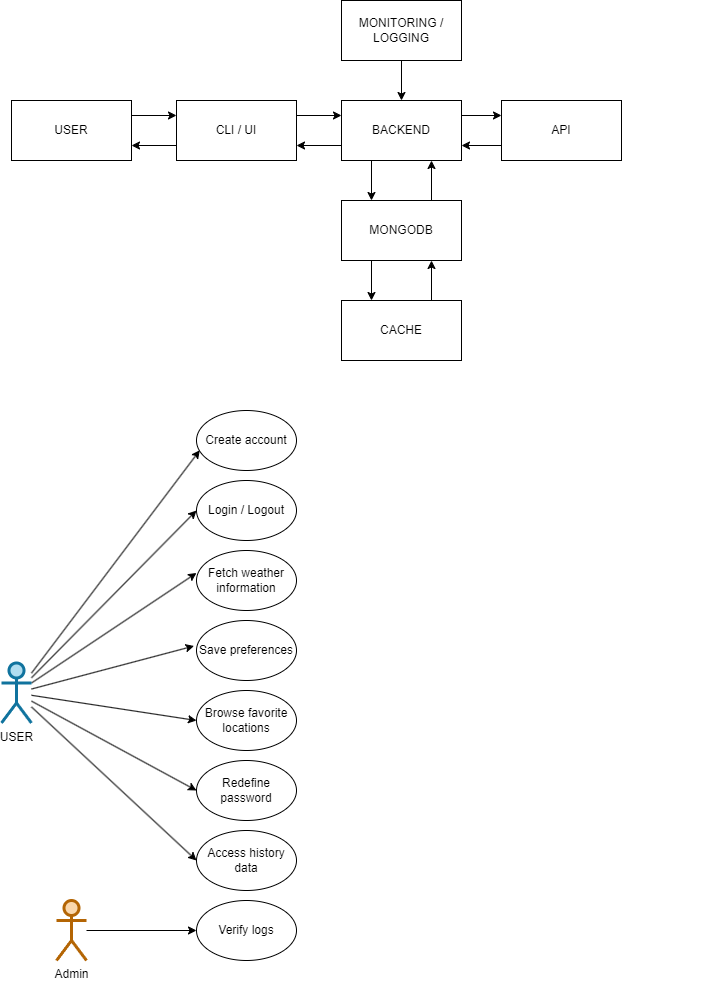

# Weatherly Functional Requirements
## 1. User Registration & Authentication
### 1.1. User Registration  

- The system should allow new users to register by providing an email, and password.
- Emails shall follow correct email pattern, e.g. john.marston@email.com.
- Passwords should be securely hashed before storing them in the database.

### 1.2. User Login

- The system should allow registered users to log in by providing their credentials (email and password).
- Upon successful login, the system should generate and provide an authentication token (JWT) for secure session management.

### 1.3. User Log out

- The system should allow users to log out, invalidating their session token.

### 1.4. Password Management

- The system should provide users with the ability to reset their password through a password reset feature.

## 2. Weather Data Fetching

### 2.1. Current Weather Data

- Users should be able to search for and retrieve the current weather conditions for a specific location by entering the city name, postal code, or coordinates.
- Weather information should include temperature, humidity, wind speed, weather conditions (e.g., clear, rainy), and an icon representing the weather.

### 2.2. Weather Forecast

- The system should provide a 7-day weather forecast for the requested location, including high/low temperatures, weather conditions, and precipitation probabilities.

### 2.3. Real-Time Weather Updates

- The system should allow users to fetch updated weather data at any time by reloading or re-requesting the weather for their location.

### 2.4. Favorite Locations

- Registered users should be able to add multiple locations to their "Favorites" list for easy access to weather information.

### 2.5. Historical Weather Data

- The system should store past weather data (for each user’s favorite locations) for at least 30 days, allowing users to review historical weather conditions.

## 3. Data Storage

### 3.1. Weather Data Caching

- Weather data retrieved from the external API should be stored (cached) in MongoDB to minimize external API calls. Cached data should have an expiration time (e.g., 10 minutes) before it gets refreshed.

### 3.2. User Data Storage

- User profile data, including favorites, login details, and settings, should be stored securely in MongoDB.

## 4. User Interface (UI)

### 4.1. Search Functionality

- The UI should provide a search bar where users can enter a city name, postal code, or coordinates to fetch weather data.

### 4.2. Dashboard

- The UI should display the current weather and 7-day forecast for the user’s selected or default location on a dashboard.
Users should be able to easily switch between different locations or view weather for all their favorite locations on the dashboard.

### 4.3. Weather Display

- The UI should display weather information clearly, including temperature, wind speed, weather condition icons, and forecast details.

### 4.4. User Preferences

- Registered users should be able to set preferences such as temperature units (Celsius/Fahrenheit) and wind speed units (km/h or mph).

### 4.5. Responsive Design

- The application should be responsive, ensuring the UI adapts well to mobile, tablet, and desktop devices.

## 5. Notifications & Alerts

### 5.1. Weather Alerts

- The system should notify users of severe weather conditions (e.g., storms, heavy rain, snow) based on their selected or favorite locations.

### 5.2. Push Notifications (Optional)

- The system could offer push notifications for severe weather alerts, daily weather summaries, or when weather data for favorite locations has been updated.

## 6. Weather API Integration

### 6.1. External API Integration

- The application should be integrated with a reliable external weather API (e.g., OpenWeatherMap, WeatherAPI) to fetch real-time weather data.

### 6.2. API Rate Limiting

- The system should handle API rate limits by minimizing redundant API requests (using cached data when possible) and queuing additional requests when limits are reached.

## 7. Security Requirements

### 7.1. Data Encryption

- User data, especially sensitive information like passwords and session tokens, should be encrypted.

### 7.2. Secure API Endpoints

- All API endpoints that deal with sensitive user data should be protected with authentication and authorization checks.

### 7.3. Role-Based Access Control (RBAC)

- Ensure that certain actions (e.g., accessing personal weather data or managing favorites) are restricted to authenticated users only.

### 7.4. Input Validation

- Ensure proper validation of all user inputs (e.g., city names, coordinates) to prevent injection attacks or data corruption.

## 8. Performance and Scalability

### 8.1. Caching Strategy

- The system should cache frequently accessed weather data (e.g., for popular locations) to minimize the load on external APIs and improve response times.

### 8.2. Efficient API Handling

- Ensure the application is capable of handling a large volume of simultaneous API requests asynchronous capabilities (e.g. FastAPI).

### 8.3. Scalability

- The system should be designed to handle high traffic and easily scale to support additional users, locations, and features.

## 9. Location services

### 9.1. Language Support

- The application shall be presented in english language.

### 9.2. Timezone Support

- Weather data should be presented in the local time zone of the requested location.

## 10. Logging and Monitoring

### 10.1. API Call Logging

- The system should log all API requests and responses for monitoring and debugging purposes.

### 10.2. Error Logging

- Ensure that any errors or failures (e.g., failed API calls, database errors) are logged for troubleshooting.

## 11. Future Features (Optional)

### 11.1. Weather Maps

- Add functionality for displaying weather maps, including radar, temperature, and precipitation maps, for a visual representation of weather data.

### 11.2. Social Sharing

- Users should be able to share weather reports or forecasts on social media platforms directly from the app.

### 11.3. Custom Weather Alerts

- Allow users to set custom weather alerts based on specific conditions (e.g., temperature drops below a certain point).

## 12. System Design

## 13. Project Phases
### 13.1. Weather Fetch CLI

- Weather data fetched by a simple command line interface.

### 13.2. Weather Fetch CLI Advanced 

- Weather data fetched by a simple command line interface, complex operations such as login, specific weather information will be in use.

### 13.3. Weather Fetch CLI DB 

- Weather information will be stored in mongo database along with user credentials.

### 13.4. Weather Fetch CLI Optimization 

- Weather information fetch will be improved, caching and other functionalities will be added.

### 13.5. Logging

- Traceability of system events will be logged and stored initially in filesystem

### 13.6. Weather Fetch UI

- Weather data fetched by User Interface.

- TODO: To be decided between desktop UI or Web UI.
